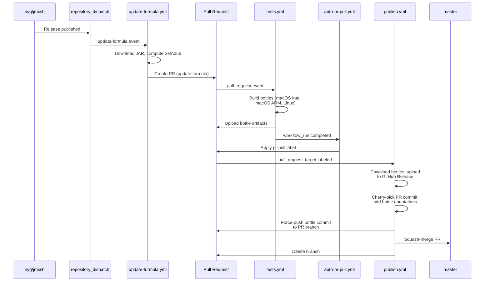

# homebrew-jmxsh

Homebrew tap for [jmxsh](https://github.com/nyg/jmxsh) — an interactive command-line JMX client for monitoring and managing Java applications.

**Website:** [jmx.sh](https://jmx.sh)

## Installation

```sh
brew install nyg/jmxsh/jmxsh
```

Or tap first, then install:

```sh
brew tap nyg/jmxsh
brew install jmxsh
```

Or in a [`Brewfile`](https://github.com/Homebrew/homebrew-bundle):

```ruby
tap "nyg/jmxsh"
brew "jmxsh"
```

## Usage

Once installed, run `jmxsh` to start the interactive shell. See the [upstream documentation](https://github.com/nyg/jmxsh) for the full command reference.

## Automated Formula Updates

When a new release is published in [`nyg/jmxsh`](https://github.com/nyg/jmxsh), the formula in this tap is updated and published automatically — no manual steps required.

### Pipeline overview



### Step-by-step

1. **Trigger** — A release in `nyg/jmxsh` sends a [`repository_dispatch`](https://docs.github.com/en/actions/writing-workflows/choosing-when-your-workflow-runs/events-that-trigger-workflows#repository_dispatch) event to this repository with the new version, JAR URL, and Java version.

2. **Update formula** ([`update-formula.yml`](.github/workflows/update-formula.yml)) — Downloads the JAR, computes its SHA256, updates the formula's `url`, `sha256`, and optionally `depends_on` fields, then opens a PR on a branch named `update-jmxsh-<version>`.

3. **Test** ([`tests.yml`](.github/workflows/tests.yml)) — Runs `brew test-bot` on three platforms (macOS Intel, macOS ARM, Linux). Builds bottles and uploads them as workflow artifacts.

4. **Auto-label** ([`auto-pr-pull.yml`](.github/workflows/auto-pr-pull.yml)) — Triggered when `tests.yml` completes successfully on an `update-jmxsh-*` branch. Applies the `pr-pull` label to the PR. Uses `HOMEBREW_TAP_TOKEN` so the label event triggers the next workflow (events from `GITHUB_TOKEN` don't trigger downstream workflows).

5. **Publish** ([`publish.yml`](.github/workflows/publish.yml)) — Triggered by the `pr-pull` label. Runs `brew pr-pull` which downloads bottle artifacts, uploads the bottle tarballs to a GitHub Release, cherry-picks the PR commit, and amends it with a `bottle` block. The bottle-annotated commit is then force-pushed back to the PR branch and squash-merged into master via the GitHub API.
